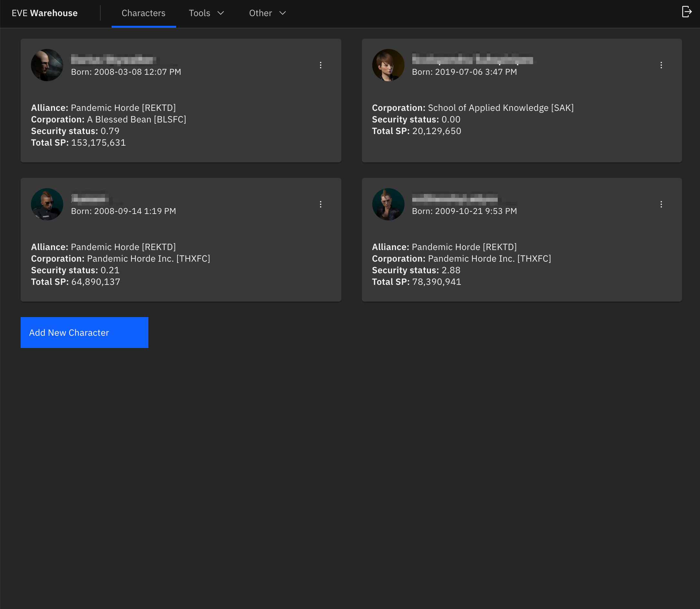
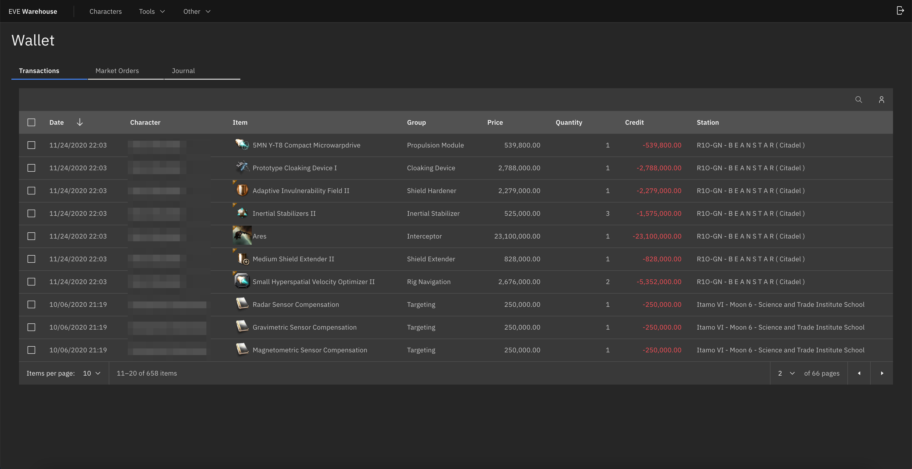
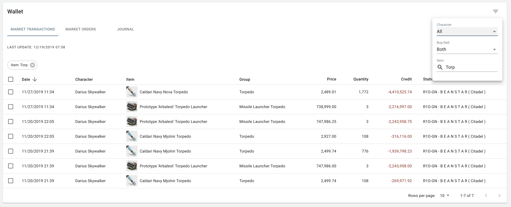
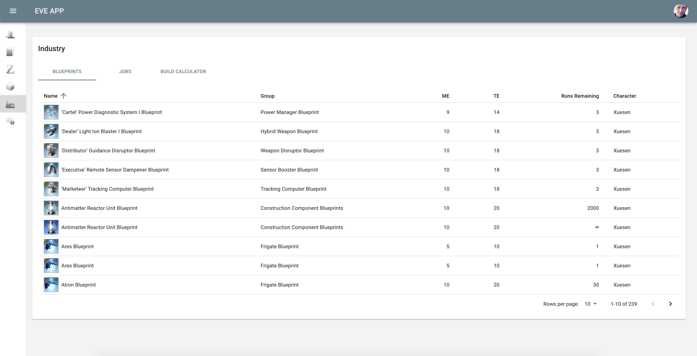

## Eve Warehouse

Eve Online web application for character monitoring, industry

See also: 

  * [Eve GraphQL API](https://github.com/dariusbakunas/eve-api)
  * [Background processing](https://github.com/dariusbakunas/eve-processors)

### Features

#### Multiple characters

Add multiple characters:

#### Wallet

Combined transactions, custom filters:

#### Industry

List of blueprints:

